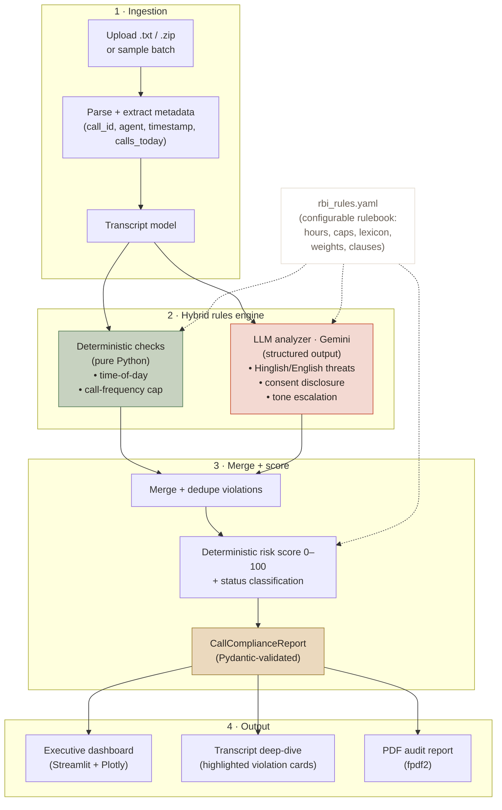

# RBI Compliance & Call Quality Inspector

> An AI-assisted audit system that scans debt-collection call transcripts for **RBI
> recovery-agent violations** — including *subtly-coded Hinglish coercion* — scores
> each call into a validated schema, and produces an executive dashboard plus
> regulator-ready PDF audit reports.

**Stack:** Python · Streamlit · Google Gemini (structured output) · Pydantic · Plotly · fpdf2
**Runs:** locally or on Streamlit Cloud, free-tier friendly.

<!-- Add a screenshot here once deployed:  -->

---

## TL;DR

| | |
| --- | --- |
| **What** | Batch-audits collection call transcripts against RBI Fair Practices rules |
| **How** | Hybrid engine — deterministic Python for objective facts, LLM for language judgment |
| **Output** | Validated compliance telemetry, risk score (0–100), dashboard, PDF audit |
| **Quality** | 33-call adversarial eval: **97% status accuracy · call-level recall 1.00 · ~5% false-positive rate** |
| **Honest scope** | Prototype · batch/offline · synthetic (but adversarial) eval data |

---

## The problem

Lenders (banks, NBFCs) increasingly run **automated voice agents** for EMI
reminders and debt recovery. Every one of those calls is regulatory exposure under
the **RBI Master Direction / Fair Practices Code for recovery agents**:

- Calling outside permitted hours (08:00–19:00)
- Missing the mandatory call-recording / identity disclosure
- Coercion or threats — police, jail, court, home visits, public shaming
  (*beizzati*), often in **Hinglish or code-switched** language
- Excessive re-contact (harassment)

Keyword filters miss the hard cases — a threat like *"main dhamki nahi de raha,
par mere paas aapka ghar ka address hai..."* has no banned keyword. Detecting it
needs contextual language understanding. Detecting *call timing* does not — that's
just a timestamp comparison. **This project draws that line deliberately.**

---

## Architecture



**Core design principle — hybrid by intent:**

| Concern | Engine | Why |
| --- | --- | --- |
| Call timing, call frequency | **Deterministic Python** | Objective facts; reproducible, cheap, defensible in an audit |
| Threats, coercion, consent, tone | **LLM (Gemini)** | Needs contextual/bilingual language judgment |
| Risk score & status | **Deterministic Python** | Final number must be reproducible regardless of LLM stochasticity |

---

## End-to-end workflow

```
Upload transcripts (.txt / .zip)
        │
        ▼
Ingestion  ──►  Transcript { call_id, agent_id, customer_id, timestamp, calls_today, text }
        │
        ├──────────────► Deterministic checks ──► time-of-day, call-cap violations
        │
        └──────────────► Gemini analyzer ──────► threat / consent / tone violations
                          (native structured output → Pydantic-validated JSON,
                           1 retry, model fallback on transient errors)
        │
        ▼
Merge + dedupe  ──►  Deterministic scoring (severity weights → 0–100 → status)
        │
        ▼
CallComplianceReport (validated)  ──►  Dashboard · Deep-dive · PDF audit
```

If no API key is present, the LLM stage is skipped gracefully and the app runs
**deterministic-only** (still fully usable for timing/frequency auditing).

---

## Key engineering decisions

- **Knowing when *not* to use an LLM.** Timing and frequency are computed in
  Python, not guessed by a model. This is the single most important design call.
- **Regulation as auditable config.** All rules — hours, caps, threat lexicon,
  severity weights, clause references — live in a versioned `rbi_rules.yaml`. No
  fabricated clause numbers hardcoded in prompts; a compliance officer can edit
  the rulebook without touching code.
- **Schema-first, structured output.** The Pydantic model is the contract. Gemini
  is asked to fill it via native structured output; Python validates it; the UI
  and PDF consume it. One retry on validation failure; automatic model fallback on
  transient 503s.
- **Untrusted-input handling.** Transcripts are fenced and treated as untrusted —
  any instructions embedded inside a transcript are explicitly ignored.
- **Graceful degradation & provider abstraction.** Works with no key; the
  `LLMProvider` interface keeps the vendor swappable.
- **Measured, honestly.** A 33-call *adversarial* eval reports a confusion matrix,
  false-positive rate, and per-category precision/recall — and documents the
  failure modes rather than hiding them.

---

## Results (representative, live model)

Run over a 33-call labeled corpus (see [docs/EVALUATION.md](docs/EVALUATION.md)):

| Metric | Value | Note |
| --- | --- | --- |
| Compliance-status accuracy | **32/33 (97%)** | Correct COMPLIANT / REVIEW / NON_COMPLIANT bucket |
| Call-level recall | **1.00** | Caught every truly-violating call (zero false negatives) |
| Call-level precision | **0.92** | |
| False-positive rate | **~5% (1/22)** | On firm-but-legal calls — over-flagging is the expensive error |
| Category F1 (micro) | **≈ 0.81** | time-of-day 1.00 · threat 0.80 · harassment 0.75 · consent 0.67 |

The eval **surfaces its own failures** (subtle-threat-vs-harassment confusion, a
late-consent over-flag) rather than cherry-picking. Numbers vary slightly
run-to-run because the model is stochastic.

---

## Data model

```
CallComplianceReport
├─ call_id, agent_id, customer_id, timestamp
├─ compliance_status : COMPLIANT | REVIEW | NON_COMPLIANT
├─ overall_risk_score : 0–100  (deterministic)
├─ time_of_day_compliant : bool
├─ consent_given : bool          ← single source of truth for consent
├─ call_count_today : int
├─ agent_coaching_summary : str
└─ violations : [ Violation ]
       ├─ type, severity (CRITICAL|WARNING|INFO)
       ├─ timestamp_offset, quote (verbatim)
       ├─ rbi_clause  (from rulebook)
       ├─ source (deterministic | llm)
       └─ confidence (0–1, LLM only)
```

---

## Project structure

```
rbi-compliance-checker/
├─ app.py                     # Streamlit UI (dashboard + deep-dive + PDF export)
├─ compliance/
│  ├─ config.py               # env, model IDs, rulebook path
│  ├─ models.py               # Pydantic contract (Transcript, Violation, Report)
│  ├─ ingestion.py            # .txt / .zip parsing + metadata extraction
│  ├─ rules.py                # rulebook loader + deterministic checks + CLI
│  ├─ llm_provider.py         # LLMProvider interface + GeminiProvider
│  ├─ analyzer.py             # prompt + structured output + retry + escalation
│  ├─ scoring.py              # deterministic risk score + status
│  ├─ pipeline.py             # orchestration (single + resilient batch)
│  └─ report_pdf.py           # fpdf2 audit report (unicode-safe)
├─ rules/rbi_rules.yaml       # configurable RBI rulebook
├─ data/
│  ├─ samples/                # demo transcripts
│  └─ eval_corpus/            # adversarial + filler eval transcripts
├─ eval/
│  ├─ labeled_set.jsonl       # 33-call labeled corpus
│  ├─ run_eval.py             # metrics: confusion matrix, P/R/F1, FP rate
│  └─ generate_filler.py      # scenario-driven filler generation
├─ tests/                     # 43 tests (unit, pipeline, false-positive, live-gated)
├─ assets/theme.css           # Craft AI-inspired UI theme
└─ docs/                      # architecture, evaluation, rules, pitch, design
```

---

## Tech stack

| Component | Tool | Function |
| --- | --- | --- |
| Inference | Google Gemini (`gemini-flash-latest`, `-pro-latest` escalation, lite fallback) | LLM reasoning with native structured JSON output |
| Schema | `pydantic` v2 | Validated, type-safe compliance telemetry |
| Frontend | `streamlit` + `plotly` | Dashboard + transcript deep-dive |
| Reports | `fpdf2` | PDF audit certificates (unicode-safe) |
| Config | `pyyaml` + `python-dotenv` | Rulebook + secrets |
| Testing | `pytest` | 43 tests incl. mocked + live-gated |
| Runtime | Python 3.10+ | Local or Streamlit Cloud |

---

## Quick start

```bash
# 1. Install dependencies
pip install -r requirements.txt

# 2. Configure your Gemini key (free tier: https://aistudio.google.com/apikey)
cp .env.example .env          # then edit .env and set GEMINI_API_KEY=...

# 3. Run the app
streamlit run app.py          # then click "Load sample batch" in the sidebar
```

**No API key?** The app still runs deterministic checks (timing + frequency):

```bash
python -m compliance.rules data/samples   # per-call status + score, offline
```

**Run the tests / eval:**

```bash
pytest -q                     # 43 tests
python eval/run_eval.py       # confusion matrix + precision/recall
python eval/run_eval.py --no-llm   # deterministic-only baseline
```

> If an unrelated global pytest plugin errors on load, disable third-party
> autoload: `PYTEST_DISABLE_PLUGIN_AUTOLOAD=1 pytest -q`
> (PowerShell: `$env:PYTEST_DISABLE_PLUGIN_AUTOLOAD="1"; pytest -q`)

---

## Documentation

| Doc | Purpose |
| --- | --- |
| [docs/ARCHITECTURE.md](docs/ARCHITECTURE.md) | System design, modules, data model |
| [docs/EVALUATION.md](docs/EVALUATION.md) | Eval methodology, data honesty, failure modes |
| [docs/RBI_RULES.md](docs/RBI_RULES.md) | Rulebook explanation + regulatory disclaimer |
| [docs/PLAN.md](docs/PLAN.md) | Implementation plan & task breakdown |
| [docs/DESIGN_SYSTEM.md](docs/DESIGN_SYSTEM.md) | UI theme & palette |
| [docs/PITCH.md](docs/PITCH.md) | Project context & narrative |

---

## Scope & honesty

This is a **prototype**, framed honestly:

- It audits **finished text transcripts in batch** — not real-time voice/streaming.
- The evaluation corpus is **synthetic and adversarial by design**. Real
  collection transcripts are confidential borrower PII and rightly unavailable;
  the synthetic set is built to be *hard*, not to be real.
- The RBI clause references in the rulebook are **configurable placeholders** and
  must be verified against the official
  [RBI Master Direction / Fair Practices Code](https://www.rbi.org.in) before any
  real regulatory use. This tool is decision-support and QA tooling, not legal
  advice.

What production would still require is documented in
[docs/EVALUATION.md](docs/EVALUATION.md) (independent human labeling, real
consented data, calibrated confidence, real-time guardrails).
