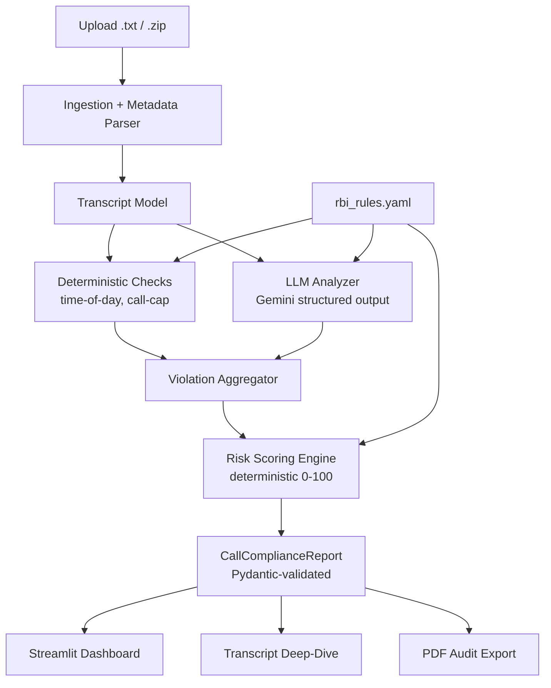

# Architecture

## High-level flow



## Design principles

1. **Deterministic where the law is deterministic.** Time-of-day and call-cap
   are objective facts computed in Python. Only language judgment (threats,
   consent, tone) goes to the LLM. This is more accurate, cheaper, reproducible,
   and defensible in an audit.
2. **Regulation as auditable config.** The rulebook is a versioned YAML file, not
   scattered constants. Compliance officers can review and correct it without
   touching code.
3. **Schema-first.** The Pydantic model is the contract. The LLM is asked to fill
   it via native structured output; Python validates it; the UI and PDF consume it.
4. **Graceful degradation.** No API key -> deterministic checks still run.
5. **Provider-agnostic.** `LLMProvider` interface keeps Gemini swappable.

## Module layout

```
rbi-compliance-inspector/
  app.py                      # Streamlit entry (dashboard + deep-dive + export)
  compliance/
    __init__.py
    config.py                 # env + model IDs + rulebook path
    models.py                 # Pydantic: Transcript, Violation, CallComplianceReport
    ingestion.py              # .txt/.zip parsing + metadata extraction
    rules.py                  # rulebook loader + deterministic checks
    llm_provider.py           # LLMProvider interface + GeminiProvider
    analyzer.py               # LLM prompt + structured-output call + parsing
    scoring.py                # deterministic risk scoring + status
    pipeline.py               # orchestrates ingest -> checks -> llm -> score -> report
    report_pdf.py             # fpdf2 audit report
  rules/rbi_rules.yaml
  data/samples/               # sample transcripts
  eval/labeled_set.jsonl      # small labeled eval set
  eval/run_eval.py            # precision/recall on violation detection
  tests/                      # pytest unit tests per module
  .env.example
  requirements.txt
  README.md
  docs/
```

## Data model

### `Transcript`
| Field | Type | Notes |
| --- | --- | --- |
| `call_id` | str | Unique per call |
| `agent_id` | str | Collection agent identifier |
| `customer_id` | str | Borrower identifier |
| `timestamp` | datetime | Call start |
| `call_count_today` | int | Outreach attempts to this borrower today |
| `text` | str | Raw transcript with optional `[mm:ss]` offsets |

### `Violation`
| Field | Type | Notes |
| --- | --- | --- |
| `type` | str | e.g. "Illegal Threat Term" |
| `severity` | enum | `CRITICAL / WARNING / INFO` |
| `timestamp_offset` | str | `mm:ss` within the call |
| `quote` | str | Verbatim offending text |
| `rbi_clause` | str | Reference from the rulebook |
| `source` | enum | `deterministic / llm` |
| `confidence` | float\|null | LLM confidence when applicable |

### `CallComplianceReport`
| Field | Type | Notes |
| --- | --- | --- |
| `call_id` | str | |
| `agent_id` | str | |
| `customer_id` | str | |
| `timestamp` | datetime | |
| `compliance_status` | enum | `COMPLIANT / NON_COMPLIANT / REVIEW` |
| `overall_risk_score` | int | 0-100, deterministic |
| `time_of_day_compliant` | bool | |
| `consent_given` | bool | |
| `call_count_today` | int | |
| `violations` | list[Violation] | |
| `agent_coaching_summary` | str | |

## Scoring model (deterministic)

- Each violation contributes its severity weight from the rulebook
  (e.g. CRITICAL=40, WARNING=20, INFO=5).
- Score is the capped sum (max 100).
- Status: `NON_COMPLIANT` if any CRITICAL or score >= threshold; `REVIEW` if only
  WARNING/INFO above a low threshold; else `COMPLIANT`.
- All thresholds live in the rulebook.

## LLM interaction

- Input: transcript text + rulebook lexicon + metadata context.
- Output: structured JSON constrained to the violations schema (consent flag,
  threat/tone violations with verbatim quotes + offsets + confidence).
- Transcript text is treated as **untrusted data** — any embedded "instructions"
  inside a transcript are ignored.
- One retry on validation failure; optional escalation to the pro model for
  high-severity or low-confidence cases.
